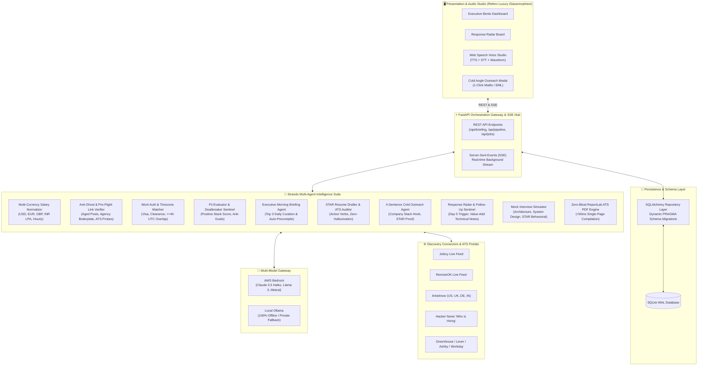
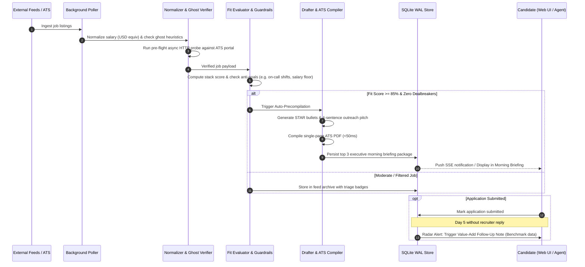

# RolePointer 🎯

> **Autonomous Multi-Agent Career Intelligence & Job Discovery Platform**  
> *Engineered for high-signal opportunity curation, anti-ghost filtering, compensation standardization, ATS resume compilation, and high-leverage recruiter outreach.*

[](https://www.python.org/)
[](https://fastapi.tiangolo.com)
[](https://github.com/strands-ai)
[](https://www.sqlite.org/wal.html)
[]()
[]()

---

## 🌟 Executive Overview

**RolePointer** is a local-first, privacy-grounded multi-agent system built to eliminate modern job discovery fatigue. Traditional job search platforms subject candidates to endless manual scrolling, stale ghost listings, misleading compensation ranges, and automated applicant tracking systems (ATS) that discard resumes for arbitrary keyword mismatches.

RolePointer acts as a **proactive background career sentinel**:
1. **Scours & Normalizes**: Ingests feeds from remote job boards, global country/city portals, Hacker News *"Who is hiring?"* threads, and direct ATS links, standardizing global compensation (USD, EUR, GBP, INR LPA) into equivalent annual figures.
2. **Filters Noise**: Employs heuristic classifiers to eliminate ghost jobs (>60-day reposts, agency boilerplate) and runs pre-flight async HTTP probes against ATS portals (Greenhouse, Lever, Ashby, Workday) to detect closed postings before you waste time.
3. **Curates & Pre-compiles**: Identifies the **Top 3 high-fit opportunities daily** ($\ge 85\%$ fit, zero dealbreakers), autonomously pre-compiling bespoke ATS-optimized resumes and high-converting 4-sentence cold engineering angles.
4. **Tracks Radar & Follows Up**: Monitors application response latency, triggering at **Day 5 without a reply** with a high-value technical benchmark note rather than an empty follow-up bump.
5. **Interactive Voice Studio**: Provides real-time verbal technical and behavioral mock interview simulation powered by the Web Speech API.

---

## 🏛️ System Architecture



---

## 🔄 Autonomous Opportunity Lifecycle



---

## 💎 Key Features & Production Moats

### 1. Multi-Currency Compensation Normalizer
- **Global Range Parsing**: Automatically extracts compensation ranges across currencies: USD (`$140k–$180k`, `$75/hr`), EUR (`€80k–€100k`), GBP (`£90k`), and INR (`₹30 LPA` / Lakhs Per Annum).
- **Annual USD Standardization**: Normalizes foreign rates and hourly contractor figures into equivalent annual USD figures using dynamic exchange rates (`EUR: 1.08`, `GBP: 1.28`, `INR: 0.012`) for standardized comparison.
- **Pay Model Detection**: Distinguishes `Base + Bonus`, `Base Only`, `Hourly Contractor`, and flags `Equity-Only` caveats.

### 2. Anti-Ghost Job Heuristics & Dead Link Pre-Flight Verifier
- **4-Tier Ghost Detection**: Penalizes postings aged $>60$ days, staffing agency boilerplate ("confidential client", "our direct client"), and generic low-detail listings.
- **Async ATS Probing**: Probes Greenhouse, Lever, Ashby, and Workday application endpoints to detect `404 Not Found`, expired job tokens, or "position closed" markers before you invest effort into applying.

### 3. Work Authorization & Timezone Compatibility Matcher
- **Geographic Visa Boundaries**: Hard-filters listings with strict legal barriers (`Remote (US Only)`, `Security Clearance Required`, `Must have EU citizenship`).
- **UTC Overlap Matrix**: Calculates daily business-hour overlap between the candidate's timezone and the employer's headquarters ($\ge 4.0\text{h}$ required).

### 4. High-Leverage Recruiter Cold Outreach Generator
- **4-Sentence Engineering Pitch**: Formats punchy outreach messages structured as:
  $$\text{Stack Hook} \longrightarrow \text{Quantified STAR Metric} \longrightarrow \text{30-Day Value Proposition} \longrightarrow \text{Low-Friction CTA}$$
- **Multi-Client Handoff**: Generates direct `mailto:` links and downloadable RFC 5322 `.eml` files for native mail clients (Outlook, Apple Mail, Gmail), preserving candidate domain reputation.
- **LinkedIn InMail Mode**: Outputs concise 3-line InMail hooks optimized for recruiter direct messaging.

### 5. Application Response Radar & Value-Add Follow-Up Sentinel
- **Response Latency Sentinel**: Flags submitted applications that reach **Day 5 without a reply**.
- **Value-Add Follow-Up**: Drafts a 2-sentence technical benchmark follow-up note sharing performance benchmarks or architectural insights instead of an empty, passive "just following up" bump.

### 6. Zero-Bloat ATS PDF Resume Compiler
- **Instant ReportLab Engine**: Compiles pixel-perfect, single-page ATS-formatted resumes in **$<50\text{ms}$**.
- **Zero LaTeX/MiKTeX Bloat**: Eliminates multi-gigabyte TeX distributions and font ligature artifacts (`fi`, `fl`) that confuse automated ATS parsers.

### 7. Interactive Voice Mock Interview Studio
- **Web Speech API Integration**: Integrated Text-to-Speech (TTS) question narrator and real-time Speech-to-Text (STT) candidate response dictation.
- **Live Waveform Visualizer**: CSS/SVG audio visualizer reflecting verbal activity.
- **Multi-Category AI Evaluation**: Grades answers across Technical Core, System Design, STAR Behavioral, and Culture Alignment with ideal reference solutions.

---

## 🗂️ Project Layout

```
rolepointer/
├── src/rolepointer/
│   ├── agents/
│   │   ├── briefing_agent.py        # Executive Top-3 morning briefing curator
│   │   ├── cold_angle_agent.py      # 4-sentence recruiter outreach generator
│   │   ├── drafter.py               # STAR bullet generator & tailored pitch drafter
│   │   ├── fit_evaluator.py         # Match scoring & guardrail triage sentinel
│   │   ├── followup_agent.py        # 5-day response radar & value-add note agent
│   │   ├── interview_agent.py       # 4-stage mock interview simulator & evaluator
│   │   ├── profile_importer.py      # Resume/LinkedIn bio parser & profile syncer
│   │   └── reviewer.py              # ATS keyword auditor & hallucination checker
│   ├── api/
│   │   └── main.py                  # FastAPI orchestration gateway & SSE push hub
│   ├── compiler/
│   │   └── pdf_engine.py            # ReportLab zero-bloat ATS resume PDF compiler
│   ├── core/
│   │   ├── model_config.py          # AWS Bedrock + Local Ollama multi-model gateway
│   │   └── settings.py              # Pydantic-settings configuration
│   ├── db/
│   │   ├── models.py                # SQLAlchemy ORM models (Jobs, Profile, Applications)
│   │   └── repository.py            # SQLite WAL persistence layer with schema migrations
│   ├── feeds/
│   │   ├── connectors.py            # Jobicy, RemoteOK, Arbeitnow, HN, URL scrapers
│   │   ├── email_exporter.py        # RFC 5322 .eml and URL-safe mailto generator
│   │   ├── link_and_ghost_verifier.py # Anti-ghost scoring & async ATS pre-flight probe
│   │   ├── salary_normalizer.py     # Multi-currency range parser & USD normalizer
│   │   └── work_auth_filter.py      # Visa/clearance filter & UTC timezone calculator
│   ├── models/
│   │   └── schemas.py               # Pydantic v2 data contracts & enums
│   ├── scheduler/
│   │   └── poller.py                # Autonomous background poller with error isolation
│   └── static/
│       └── index.html               # Refero luxury glassmorphic web dashboard & audio studio
├── tests/
│   └── test_rolepointer.py          # Pytest suite (27/27 passing tests)
├── pyproject.toml                   # uv project definition & dependencies
└── README.md                        # Documentation
```

---

## 🚀 Quick Start Guide

### Prerequisites
- **Python 3.12+**
- **uv** package manager (`pip install uv` or `curl -LsSf https://astral.sh/uv/install.sh | sh`)
- *(Optional)* AWS Credentials for AWS Bedrock **or** Local [Ollama](https://ollama.com/) instance (`ollama run llama3.2`)

### 1. Installation & Environment Setup

```bash
# Clone the repository
git clone https://github.com/your-username/rolepointer.git
cd rolepointer

# Install all dependencies with uv
uv sync

# Configure environment variables
cp .env.example .env
```

### 2. Configure Model Provider (`.env`)

#### Option A: AWS Bedrock (Recommended for Cloud)
```env
AWS_ACCESS_KEY_ID="your_access_key"
AWS_SECRET_ACCESS_KEY="your_secret_key"
AWS_REGION="us-east-1"
BEDROCK_MODEL_ID="anthropic.claude-3-5-haiku-20241022-v1:0"
USE_LOCAL_MODEL=false
```

#### Option B: Local Ollama (100% Offline & Private)
```env
USE_LOCAL_MODEL=true
LOCAL_MODEL_NAME="llama3.2"
OLLAMA_BASE_URL="http://localhost:11434/v1"
```

### 3. Launch the Application

```bash
# Start the FastAPI server with live reloading
uv run uvicorn rolepointer.api.main:app --reload --port 8000
```

Open your browser at **`http://127.0.0.1:8000`** to access the dashboard.

---

## 🧪 Testing & Quality Assurance

RolePointer includes a comprehensive automated test suite with full coverage across all architectural subsystems:
- **Feeds & Parsers**: Multi-currency compensation normalizers, anti-ghost heuristics, pre-flight ATS link probes, and geographic/timezone compatibility filters.
- **Agent Pipelines**: Fit evaluation, STAR resume bullet tailoring, zero-hallucination ATS keyword auditing, 4-sentence cold angle drafting, and 5-day response radar alerts.
- **Engines & Storage**: ReportLab sub-50ms PDF compilation and SQLite WAL dynamic schema migrations.
- **API & SSE**: REST routing, package downloads, profile imports, and real-time streaming.

To run the full test suite:

```bash
uv run pytest
```

---

## 📡 API Reference

| Endpoint | Method | Description |
| :--- | :---: | :--- |
| `/` | `GET` | Refero Luxury Dark Glassmorphic Dashboard & Voice Studio |
| `/api/briefing` | `GET` | Top 3 daily high-fit opportunities with pre-compiled packages |
| `/api/pipeline` | `GET` | Application tracking radar with 5-day response alerts |
| `/api/jobs/{id}/ghost-analysis` | `GET` | Returns anti-ghost heuristic risk score and detailed reason |
| `/api/jobs/{id}/verify-link` | `POST` | Runs async pre-flight HTTP probe against target ATS portal |
| `/api/jobs/{id}/cold-angle` | `POST` | Generates 4-sentence outreach pitch & 3-line LinkedIn InMail |
| `/api/tools/normalize-salary` | `POST` | Parses and standardizes multi-currency salary text |
| `/api/tools/check-work-auth` | `POST` | Evaluates visa clearance, geographic, and UTC timezone overlap |
| `/api/jobs/{id}/prepare-package` | `POST` | On-demand Drafter $\rightarrow$ Reviewer $\rightarrow$ PDF compilation |
| `/api/jobs/{id}/pdf` | `GET` | Downloads clean ReportLab single-page ATS PDF |
| `/api/jobs/{id}/eml` | `GET` | Downloads RFC 5322 `.eml` direct outreach pitch file |
| `/api/jobs/{id}/mailto` | `GET` | Returns URL-safe pre-formatted mailto link |
| `/api/jobs/{id}/generate-followup` | `POST` | Generates 2-sentence value-add benchmark follow-up note |
| `/api/jobs/{id}/send-followup` | `POST` | Marks follow-up sent and resets radar timer |
| `/api/profile/import` | `POST` | Parses raw resume/LinkedIn bio and syncs candidate profile |
| `/api/interview/{id}/start` | `POST` | Initializes 4-stage mock interview session |
| `/api/interview/{id}/evaluate` | `POST` | Evaluates candidate verbal/typed response in real-time |
| `/api/scheduler/trigger` | `POST` | Manually triggers discovery cycle across all feeds |
| `/api/stream` | `GET` | Real-time Server-Sent Events (SSE) push stream |

---

## 📄 License

Distributed under the MIT License.
