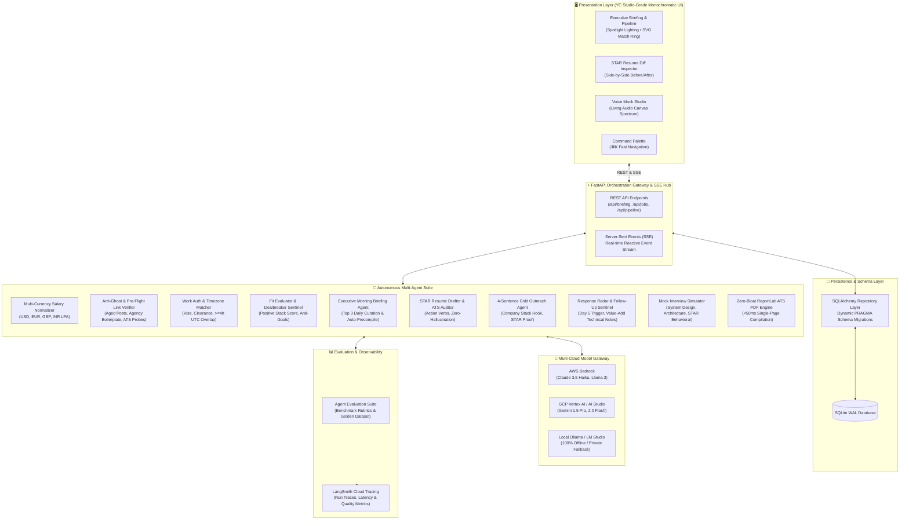
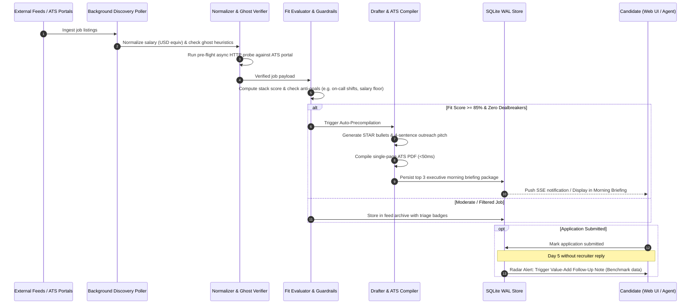

# Pointer 🎯

> **Autonomous Multi-Agent Career Intelligence, Opportunity Sentinel & Recruiter Outreach Gateway**  
> *Built for precision opportunity curation, anti-ghost filtering, multi-currency compensation standardization, sub-50ms ATS resume compilation, and high-leverage outreach.*

[](https://www.python.org/)
[](https://fastapi.tiangolo.com)
[](https://github.com/Saumojit30/Pointer)
[](https://smith.langchain.com/)
[](https://www.sqlite.org/wal.html)
[]()
[](https://opensource.org/licenses/MIT)

---

## 🌟 Overview

**Pointer** is a privacy-first, local-first multi-agent autonomous system engineered to eliminate job discovery fatigue and asymmetrical hiring dynamics.

Instead of endless manual scrolling, stale ghost listings, hidden compensation brackets, and arbitrary ATS keyword rejection, Pointer acts as an **autonomous personal career sentinel**:

1. **Global Feed Ingestion & Normalization**: Automatically polls remote job feeds (Jobicy, RemoteOK), regional country portals (Arbeitnow), Hacker News *"Who is hiring?"* discussions, and custom employer URLs. Multi-currency compensations (USD, EUR, GBP, INR LPA) are normalized to annual USD equivalents.
2. **Anti-Ghost & Pre-Flight Link Sentinel**: Employs heuristic classifiers to penalize aged reposts (>45 days) and staffing boilerplate. Performs asynchronous pre-flight HTTP probes against ATS endpoints (Greenhouse, Lever, Ashby, Workday) to verify listings before you apply.
3. **Guardrail-Driven Triage & Curation**: Curates the **Top 3 high-signal opportunities daily** (>= 85% fit, zero dealbreakers), automatically pre-compiling tailored STAR resume bullets and high-leverage 4-sentence cold engineering angles.
4. **Sub-50ms ATS PDF Compilation**: Generates pixel-perfect, single-page ATS-compliant PDF resumes via a lightweight ReportLab engine with zero LaTeX/MiKTeX bloat.
5. **Response Radar & Value-Add Follow-Up**: Tracks response latency and triggers at **Day 5 without a reply** with a high-value technical benchmark note rather than an empty "just checking in" ping.
6. **Living Voice Mock Interview Studio**: Interactive technical and behavioral interview simulation powered by real-time speech recognition, synthesis, and an HTML5 canvas audio waveform visualizer.
7. **Production Agent Evaluation Framework**: Built-in benchmark evaluation suite grading reasoning rubrics with seamless **LangSmith** cloud tracing support.

---

## 🏛️ System Architecture



---

## 🔄 Autonomous Opportunity Lifecycle



---

## 💎 Core Feature Capabilities

### 1. Multi-Currency Compensation Normalizer
- **Global Format Parsing**: Automatically extracts compensation ranges across currencies: USD (`$140k–$180k`, `$75/hr`), EUR (`€80k–€100k`), GBP (`£90k`), and INR (`₹45 LPA` / Lakhs Per Annum).
- **Annual USD Standardization**: Converts foreign rates and contractor hourly figures into equivalent annual USD figures using dynamic exchange ratios for standard portfolio benchmarking.

### 2. Anti-Ghost Job Heuristics & Dead Link Pre-Flight Verifier
- **4-Tier Ghost Detection**: Penalizes postings aged >45 days, staffing agency boilerplate (*"confidential client"*, *"our direct client"*), and generic low-detail listings.
- **Async ATS Probing**: Probes Greenhouse, Lever, Ashby, and Workday application endpoints to detect `404 Not Found`, expired tokens, or closed markers before you invest effort.

### 3. Work Authorization & Timezone Compatibility Matcher
- **Geographic Boundaries**: Hard-filters listings with strict legal barriers (`Remote (US Only)`, `Security Clearance Required`, `Must have EU citizenship`).
- **UTC Overlap Matrix**: Calculates daily business-hour overlap between the candidate's timezone and the employer's headquarters (>= 4.0h required).

### 4. High-Leverage Recruiter Cold Outreach Generator
- **4-Sentence Engineering Pitch**: Formats punchy outreach messages structured as:
  $$\text{Stack Hook} \longrightarrow \text{Quantified STAR Metric} \longrightarrow \text{Strategic Solution Proposition} \longrightarrow \text{Low-Friction CTA}$$
- **1-Click Client Handoff**: Generates direct `mailto:` deep links and downloadable standard RFC 5322 `.eml` files for desktop/mobile email clients.
- **LinkedIn InMail Mode**: Outputs crisp 3-line InMail hooks optimized for recruiter messaging.

### 5. Application Response Radar & Value-Add Follow-Up
- **Latency Sentinel**: Monitors submitted applications and flags those reaching **Day 5 without a reply**.
- **Value-Add Follow-Up**: Drafts a technical benchmark follow-up note sharing performance benchmarks or architectural insights instead of an empty "just following up" bump.

### 6. Zero-Bloat ATS PDF Resume Compiler
- **Instant ReportLab Engine**: Compiles pixel-perfect, single-page ATS-formatted resumes in **<50ms**.
- **Zero LaTeX Bloat**: Eliminates multi-gigabyte TeX dependencies and font ligature artifacts (`fi`, `fl`) that confuse automated ATS parsers.

### 7. Interactive Voice Mock Interview Studio
- **Speech Synthesis & Recognition**: Real-time Text-to-Speech (TTS) question narrator and Speech-to-Text (STT) response dictation via the Web Speech API.
- **Living Audio Canvas Spectrum**: Real-time frequency waveform visualizer reflecting verbal activity.
- **Multi-Category AI Evaluation**: Grades answers across Technical Core, System Design, STAR Behavioral, and Culture Alignment.

---

## 🗂️ Project Structure

```
Pointer/
├── src/rolepointer/
│   ├── agents/
│   │   ├── briefing_agent.py        # Executive Top-3 morning briefing curator
│   │   ├── cold_angle_agent.py      # 4-sentence recruiter outreach generator
│   │   ├── drafter.py               # STAR bullet generator & tailored pitch drafter
│   │   ├── fit_evaluator.py         # Match scoring & guardrail triage sentinel
│   │   ├── followup_agent.py        # 5-day response radar & value-add note agent
│   │   ├── importer_agent.py        # Resume/LinkedIn bio parser & profile syncer
│   │   ├── interview_agent.py       # Mock interview simulator & answer evaluator
│   │   ├── email_exporter.py        # RFC 5322 .eml and URL-safe mailto generator
│   │   └── reviewer.py              # ATS keyword auditor & hallucination checker
│   ├── api/
│   │   └── main.py                  # FastAPI orchestration gateway & SSE push hub
│   ├── compiler/
│   │   └── pdf_engine.py            # ReportLab zero-bloat ATS resume PDF compiler
│   ├── core/
│   │   ├── model_config.py          # AWS Bedrock + GCP Vertex/Gemini + Ollama/LM Studio
│   │   └── settings.py              # Pydantic-settings configuration
│   ├── db/
│   │   ├── models.py                # SQLAlchemy ORM models (Jobs, Profile, Applications)
│   │   └── repository.py            # SQLite WAL persistence layer with schema migrations
│   ├── evals/
│   │   ├── benchmark_dataset.py     # Golden evaluation test dataset (Fit, Ghost, Salary, Auth)
│   │   ├── rubrics.py               # Evaluation rubrics and scoring functions
│   │   ├── runner.py                # Evaluation runner with LangSmith cloud export
│   │   └── schemas.py               # Evaluation result models and benchmark metrics
│   ├── feeds/
│   │   ├── hn_hiring_feed.py        # Hacker News 'Who is Hiring' parser
│   │   ├── link_and_ghost_verifier.py # Anti-ghost scoring & async ATS pre-flight probe
│   │   ├── location_feeds.py        # Arbeitnow regional connector
│   │   ├── mock_feeds.py            # Seed data fixture generator
│   │   ├── remote_feeds.py          # Jobicy & RemoteOK connectors
│   │   ├── salary_normalizer.py     # Multi-currency range parser & USD normalizer
│   │   ├── url_parser.py            # Custom job URL scraper & metadata extractor
│   │   └── work_auth_filter.py      # Visa/clearance filter & UTC timezone calculator
│   ├── models/
│   │   └── schemas.py               # Pydantic v2 data contracts & enums
│   ├── scheduler/
│   │   └── poller.py                # Autonomous background poller with error isolation
│   └── static/
│       └── index.html               # YC studio-grade monochromatic dashboard & voice studio
├── tests/
│   ├── test_evals.py                # Agent evaluation & benchmark test suite
│   └── test_rolepointer.py          # Comprehensive unit & integration tests (32 tests)
├── pyproject.toml                   # uv project definition & dependencies
└── README.md                        # Project documentation
```

---

## 🚀 Quick Start Guide

### Prerequisites
- **Python 3.12+**
- **uv** package manager (`pip install uv` or `curl -LsSf https://astral.sh/uv/install.sh | sh`)

### 1. Installation & Environment Setup

```bash
# Clone the repository
git clone https://github.com/Saumojit30/Pointer.git
cd Pointer

# Install dependencies with uv
uv sync
```

### 2. Multi-Cloud Gateway Configuration (`.env`)

Create a `.env` file in the root directory:

```bash
cp .env.example .env
```

Configure your preferred model provider:

#### Option A: AWS Bedrock (Recommended for Cloud)
```env
AWS_ACCESS_KEY_ID="your_access_key"
AWS_SECRET_ACCESS_KEY="your_secret_key"
AWS_REGION="us-east-1"
BEDROCK_MODEL_ID="anthropic.claude-3-5-haiku-20241022-v1:0"
```

#### Option B: Google Cloud Vertex AI / AI Studio (Gemini)
```env
GEMINI_API_KEY="your_google_ai_studio_api_key"
GEMINI_MODEL_NAME="gemini-1.5-flash"
```

#### Option C: Local Ollama / LM Studio (100% Offline & Private)
```env
USE_LOCAL_MODEL=true
LOCAL_MODEL_PROVIDER="ollama"      # or "lm_studio"
LOCAL_MODEL_NAME="llama3.2"        # or your local model id
OLLAMA_BASE_URL="http://localhost:11434/v1"
```

#### Optional: LangSmith Observability & Cloud Evals
```env
LANGSMITH_TRACING=true
LANGSMITH_API_KEY="lsv2_pt_..."
LANGSMITH_PROJECT="rolepointer-evals"
```

### 3. Launch the Server

```bash
uv run uvicorn rolepointer.api.main:app --host 127.0.0.1 --port 8000
```

Open your browser at **`http://127.0.0.1:8000`** to access the dashboard.

---

## 🧪 Testing & Evaluation

### Run Complete Test Suite (32/32 Passing)
```bash
uv run pytest
```

### Run Agent Evaluation Benchmarks
```bash
uv run pytest tests/test_evals.py -v
```

To run evaluation benchmarks and sync results directly to **LangSmith**:
```bash
uv run python -c "from rolepointer.evals import run_evaluation_suite; run_evaluation_suite(sync_langsmith=True)"
```

---

## 📡 API Reference

| Endpoint | Method | Description |
| :--- | :---: | :--- |
| `/` | `GET` | Studio-Grade Monochromatic Dashboard & Voice Mock Studio |
| `/health` | `GET` | System health check & uptime probe |
| `/api/briefing` | `GET` | Top 3 daily high-fit opportunities with pre-compiled packages |
| `/api/jobs` | `GET` | Filterable job repository with fit evaluations & triage statuses |
| `/api/jobs/import-url` | `POST` | Scrapes custom job URL and runs full guardrail pipeline |
| `/api/jobs/{id}/verify-link` | `POST` | Runs async pre-flight HTTP probe against target ATS portal |
| `/api/jobs/{id}/cold-angle` | `POST` | Generates 4-sentence outreach pitch & 3-line LinkedIn InMail |
| `/api/jobs/{id}/pdf` | `GET` | Downloads clean ReportLab single-page ATS PDF resume |
| `/api/jobs/{id}/eml` | `GET` | Downloads RFC 5322 `.eml` direct outreach pitch file |
| `/api/pipeline/{id}/apply` | `POST` | Marks job as applied and starts 5-day Response Radar clock |
| `/api/pipeline/radar` | `GET` | Returns active application tracking radar and follow-up alerts |
| `/api/pipeline/{id}/follow-up/draft` | `POST` | Generates 2-sentence value-add benchmark follow-up note |
| `/api/pipeline/{id}/follow-up/send` | `POST` | Marks follow-up sent and resets radar timer |
| `/api/profile` | `GET` / `POST` | Retrieves or updates candidate profile guardrails |
| `/api/profile/import` | `POST` | Parses raw resume/LinkedIn bio and syncs candidate profile |
| `/api/interview/{id}/start` | `POST` | Initializes 4-stage mock interview session |
| `/api/interview/{id}/evaluate` | `POST` | Evaluates candidate verbal/typed response in real-time |
| `/api/evals/run` | `POST` | Runs benchmark evaluation suite with optional LangSmith sync |
| `/api/scheduler/trigger` | `POST` | Manually triggers discovery cycle across all feeds |
| `/api/stream` | `GET` | Real-time Server-Sent Events (SSE) push stream |

---

## 🤝 Contributing

Contributions are welcome! Please follow these steps:
1. Fork the repository.
2. Create a feature branch (`git checkout -b feat/amazing-feature`).
3. Commit your changes using conventional commit messages (`git commit -m "feat(module): add amazing feature"`).
4. Verify all tests pass (`uv run pytest`).
5. Open a Pull Request.

---

## 📄 License

Distributed under the **MIT License**. See `LICENSE` for more information.
